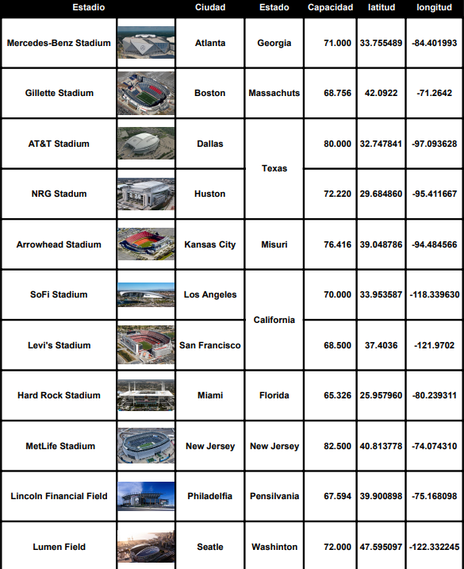
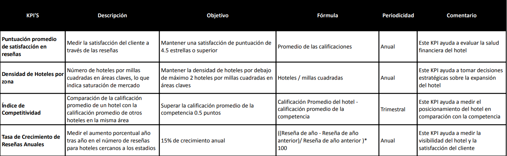

# <h1 align="center">**`Proyecto Google-Yelp(Hoteles)`**</h1>

  

## **Descripción del proyecto**

El propósito es evaluar y comparar las puntuaciones obtenidas tanto en base de datos de [google maps](https://drive.google.com/drive/folders/1Wf7YkxA0aHI3GpoHc9Nh8_scf5BbD4DA) como en [Yelp](https://drive.google.com/drive/folders/1TI-SsMnZsNP6t930olEEWbBQdo_yuIZF), con el fin de identificar las ubicaciones más propicias para el éxito y el crecimiento sostenido de los negocios. Este análisis permitirá a los inversionistas tomar decisiones informadas sobre dónde emplazar sus negocios para maximizar el potencial de retorno de la inversión.

# Pasos para la realizacion del proyecto: 
Este proyecto consto de 3 sprint bien diferenciados:

## Sprint 1:
Se enfocó en el análisis inicial y la propuesta de cómo abordar el proyecto, estableciendo el alcance del mismo y su objetivo, los Key Performance Indicator(KPI) para medir el rendimiento, las herramientas a usar para el proyecto y un analisis exploratorio de los datos obtenidos. Los pasos fueron:

**A) Se estableció el alcance del proyecto:**
Con el objetivo de cumplir con el propósito establecido y teniendo en cuenta la proximidad del próximo Mundial de Fútbol programado para el año 2026, del cual Estados Unidos será uno de los anfitriones, hemos decidido enfocarnos específicamente en los hospedajes y hoteles ubicados en las cercanías de los estadios. Esta elección se debe a que estos lugares no solo serán relevantes durante el Mundial, sino que también son y continuarán siendo escenarios de numerosos eventos y deportes, como el Fútbol Americano, que atraen a una gran cantidad de turistas anualmente.

Además, estos estadios están estratégicamente situados en ciudades importantes y prósperas de todo el país. Dada su relevancia, no solo durante el Mundial sino a lo largo del tiempo, nos centraremos en proporcionar una evaluación detallada de los hospedajes en un rango cercano a estos estadios.

En este sentido, el alcance del proyecto y su objetivo está establecido para abarcar todos aquellos negocios referenciados en google cuya ubicación geográfica ‘latitude’ y ‘longitude’ tengan una distancia igual o menor a 10 kilometros o 6.21 millas de las ubicacion geograficos de los 11 Estadios mundialistas. La ubicación de estos Estadios abarcan 9 Estados pero debido a su rango y a la cercania con otros estados limitrofes se decidio incorporar al analisis el estado de New York para MetLife Stadium(New Jersey) y el estado de Kansas para Arrowhead Stadium(Missouri).

Los 11 estadios designados para el próximo Mundial 2026 en Estados Unidos son:

  

**B) Establecimiento de los KPI:**
Se establecieron 4 KPI'S para el proyecto a fin de medir el desempeño obtenido:

  

**C) Se estableció el stock Tecnologico:**
Se realizó la eleccion de las herramientas que permitan  conseguir dichos objetivos tanto a nivel local como a nivel de la nube:

  

Herramientas y aplicaciones:
+ **visual studio code:** Para editar el codigo de python
+ **Python:** Como lenguaje de programacion para el procesamiento y análisis de los datos.
+ **Apache Beam:** Permitio realizar el modelo unificado para definir pipelines de procesamiento de datos.
+ **GitHub:** Plataforma para guardar y colaborar en equipo en la nube.
+ **Google Drive:** Utilizado para sincronización y acceso a archivos desde cualquier lugar por parte de los integrantes del equipo en la nube.
+ **Jira:** Aplicación web que permitio organizar el equipo a travéz del diagrama de GANTT.
+ **Discord:** Servicio de mensajería instantánea y chat de voz para comunicarnos en el equipo.
+ **Power BI:** Aplicacion para la visualizacion de los datos.
+ **Streamlit:** Para deployar el machine learning en la nube.

Librerías de python:
+ **Python:** Utilizado para el procesamiento y análisis de datos
+ **Pandas y Numpy:** Librerías para el manejo tabular de datos.
+ **Matplotlib y Seaborn:** Librería para visualización a travéz de gráficos y análisis exploratorio de datos.
+ **NLTK (Natural Language Toolkit):** Librería para procesamiento de lenguaje natural, incluyendo análisis de sentimiento a las reseñas hechas por los usuarios de ambas plataformas.
+ **Scikit-learn:** Librería para la realización del machine learning

Herramientas dentro de la plataforma de Google Cloud Platform(GCP):
+ **Storage:** Para guardar los datasets al principio sin transformar.
+ **Dataflow:** Para la automatizacion del ETL en la nube.
+ **Composer:** Para realizar la carga incremental automatizada.
+ **BigQuery:** Para almacenor los datos ya transformados.

**D) Preparación de los datasets:**
Se realizo en primer lugar una preparacion preliminar sobre ambas bases de datos disponibles que son la de google maps y del sitio yelp. Al encontrarse separadas en diferentes archivos 'JSON' entre otros archivos, fue necesario unificarlos en cada datsets correspondiente para realizar el EDA:
**Los achivos de preparación**:
+ [Preparacion dataset google](/EDA/Preparacion%20dataset%20google.ipynb)
+ [Preparacion dataset yelp](/EDA/Preparacion%20dataset%20yelp.ipynb)

**E) EDA(Exploratory Data Analysis) de los datos:**
En esta etapa se realizo un primer viztazo general para destacar información importante sobre ambas bases de datos y entender que datos son necesarios para el proyecto, Teniendo en cuenta valores faltantes, duplicados, valores extremos y los tipos de valores:

**Los achivos EDA:**
+ [EDA google](EDA/EDA%20google.ipynb)
+ [EDA Yelp](/EDA/EDA%20Yelp.ipynb)

## **Sprint 2:**
Se trabajó en la infraestructura del proyecto con un enfoque en ETL tanto a nivel local en un inicio para su posterior implementacion a nivel de la nube con Google Cloud Platform, preparando de esta forma el terreno para el análisis y visualizaciones de datos. En este caso se decidio avanzar unicamente con el dataset de google debido a que es mas completa para la realizacion del objetivo careciendo yelp de la informacion necesaria sobre los locales en las ciudades cercanas a los Estadios.

**A) ETL(Extract, Transform and Load):**
Se realizo el ETL a nivel a local para verificar el codigo y despues implementarlo en dataflow, sobre ambas bases de datos (Reviews Estados y metadata_sitios) de google para comprobar el codigo necesario para su posterior implementacion en la nube. Remplazando nulos por otros valores, agrgando columnas necesarias, borrando duplicados y columnas inecesarias para finalmente crear un solo dataset en conjunto de google:

+ [ETL](/ETL/ETL.ipynb)

**Modelo de entidad relacion antes de la union de ambos datasets:**
La union de ambos dataset se realiza a travez de gmap_id que es primary key de metadata_sitios y foreign key de Review_estados:

  

**B) Implementacion en GCP:**
Se configuraron las herramientas de GCP, se subieron las bases de datos preparadas a Storage, se implemento el código del ETL en Dataflow, se configuró y probó el funcionamiento de Composer para la carga incremental; y también se verificó la tabla resultado en BigQuery. 

**Con el siguiente grafico podemos observar como queda establecido el ciclo de vida del dato en la nube:**

  

## **Sprint 3:**
Se enfocó en el desarrollo del proceso de machine learning asi como también en el desarrollo de la visualización de la información obtenida y de los KPI's preestablecidos.

**A) Se realizo la visualizacón:**
Se realizó el desarrollo de los dashboard sobre la informacion obtenida en Power Bi y para aplicar los KPI's. 

**B) Desarrollo de machine learning y su implementacion en la nube:**
Se realizó en primer lugar el desarrrollo del modelo de machine learning a nivel local con python y despues se implemento en streamlit.

**Archivo de machine learning local:**

+ [Machine Learning local](/Machine%20learning/ml_hoteles_regresion_lineal.ipynb)

**Machine learning en la nube:**
+ [Machine Learning streamlit](https://modelo-g7.streamlit.app/)

**Link del GCP funcionando:**
+ [GCP Funcionando video](https://www.youtube.com/watch?v=pxHq9pUnxNM)

## **Equipo de trabajo y Roles**

**Data Engineers (Ingenieros de Datos):**

+ María Gabriela Pacheco Franco

+ Patricio Martinez Cintas

**Data Scientists (Científicos de Datos):**

+ Hector Fabio Ocampo Gaviria

**Data Analyst (Analista de Datos):**

+ Facundo José Cuerdo

+ Luis Mary Esmeralda Gaince Pereira

"# Proyecto-google-y" 
